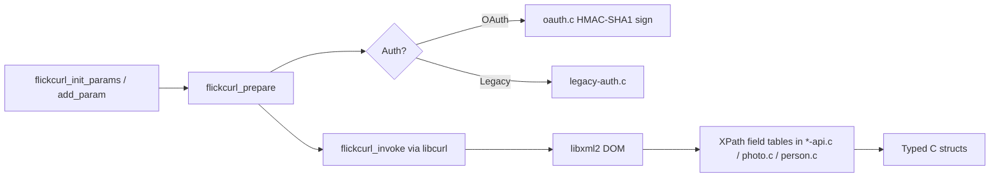

# Cursor review of Flickcurl — 2026-05-31

Deep inspection of the Flickcurl codebase after years without active
development.

**Version inspected:** 1.27 **Repository:** flickcurl git checkout
**Build environment:** macOS (darwin 25.4.0), Homebrew libcurl 8.7.1, libxml2
2.9.13, Raptor 2.0.15

---

## Executive summary

Flickcurl is a mature C library for the Flickr REST API (~37k lines of C). It
still builds and passes its tiny test suite on modern macOS, but the project has
been in maintenance-only mode since roughly 2015, with a burst of housekeeping
commits in late 2024.

| Aspect                    | Status                                 |
|:--------------------------|:---------------------------------------|
| Builds today              | Yes                                    |
| Tests pass                | Yes (2 tests only)                     |
| Last release              | 1.27 (Aug 2014)                        |
| API coverage (documented) | 90.4% (188/208) as of ~2014            |
| CI                        | Stale (Travis CI)                      |
| Security                  | Untracked secrets file needs attention |

---

## What it is

| Layer            | Role                                                                                    |
|:-----------------|:----------------------------------------------------------------------------------------|
| **libflickcurl** | Core library: OAuth signing, HTTP via libcurl, XML parsing via libxml2, typed C structs |
| **flickcurl**    | CLI that wraps ~200 API methods (`utils/commands.c`)                                    |
| **flickrdf**     | RDF triple generator from photo metadata (optional Raptor 2)                            |
| **codegen**      | Generates C stubs from Flickr's reflection API                                          |
| **libmtwist**    | Git submodule for OAuth nonces                                                          |
| **getopt**       | Bundled getopt for portability                                                          |

**Dependencies:** libcurl ≥7.10, libxml2 ≥2.6.8, Raptor 2 (optional).

**License:** LGPL 2.1+ / GPL 2+ / Apache 2.0 (triple-licensed).

---

## Architecture

Every API call follows the same pipeline:



Design choices that date the codebase:

- **XML-only** — all responses parsed with XPath field tables; no JSON path.
- **Hand-maintained wrappers** — ~33 `*-api.c` files plus builder modules
  (`photo.c`, `person.c`, etc.).
- **Dual auth** — legacy API key + secret still supported alongside OAuth 1.0a.
- **Offline dev** — `--enable-offline` reads captured XML from `captured/`;
  `--enable-capture` records live responses.

Service URIs in `common.c` use HTTPS (`api.flickr.com`, `up.flickr.com`) —
updated from the old HTTP URLs still shown in `coverage.html`.

---

## API coverage

Per `coverage.html` (last updated ~2014):

- **90.4% (188/208)** Flickr REST methods implemented
- **Missing:** `cameras.*`, `groups.discuss.*`, `photos.suggestions.*`,
  `push.*`, `flickr.auth.oauth.checkToken`, and a few others
- A **`group-topic-apis`** branch exists on origin — likely unfinished work on
  the groups discuss gap

---

## Build and CI health

**Verified on 2026-05-31 (macOS, Homebrew deps):**

```
./configure --disable-gtk-doc   ✓
make -j4                        ✓  → libflickcurl.0.dylib (~362 KB)
make check                      ✓  → 2 tests pass (oauth + mtwist)
```

**Tests are thin:**

| Test                   | What it covers                         |
|:-----------------------|:---------------------------------------|
| `flickcurl_oauth_test` | OAuth signature/preparation logic only |
| `mttest`               | PRNG in libmtwist                      |

No integration tests against Flickr. No tests for XML parsing, memory ownership,
or the 2014 bug reproducers in `bugs/`.

**CI:** `.travis.yml` targets Travis CI (gcc/clang, gtk-doc). Travis is
effectively dead; this config is stale.

**Autotools:** `configure.ac` still targets Autoconf 2.68 / Automake 1.11.
Libtool version is frozen at **`0:0:0`** — never bumped despite a decade of API
additions.

**Submodule:** `libmtwist` uses `git://github.com/dajobe/libmtwist.git` —
deprecated protocol; may fail on fresh clones without URL rewrite.

---

## Git history and release posture

| Milestone                      | When                                                                            |
|:-------------------------------|:--------------------------------------------------------------------------------|
| Last release **1.27**          | Aug 2014                                                                        |
| Last ChangeLog entry           | Jan 2015 (OAuth form double-free fix)                                           |
| Recent commits                 | Dec 2024 — C99 fixes, `curl_mime_init()` migration, MD5 alignment, buffer sizes |
| Latest commit (at review time) | 2024-12-01 — "fix css fix"                                                      |

The 2024 work is **compatibility housekeeping**, not new Flickr API coverage.

---

## Code quality findings

### Likely bugs / copy-paste issues

**`src/person.c`** — several smells from the 2014 bug reproducers
(`bugs/bug2014-11-17a.c` calls `flickcurl_people_getInfo` and appears to crash):

1. **Wrong array bound** — `person_fields_table` sized as `PHOTO_FIELD_LAST + 4`
   instead of `PERSON_FIELD_LAST + …` (harmless but wrong).
2. **Duplicate username mapping** — both `./username` and `./@username` map to
   `PERSON_FIELD_username`; the second overwrites the first.
3. **Wrong type cast** — field reset uses `(flickcurl_person_field_type)-1` for
   an integer slot.
4. **Debug typo** — `FLICKCURL_DEBUG > 1` block references undefined `value`
   instead of `string_value`.

**`src/auth-api.c:55`** — explicit FIXME: `flickcurl_auth_checkToken` "Cannot
confirm this works, get intermittent results."

**`src/tags-api.c:300`** — FIXME: docs say `user_id` is optional but
implementation requires it.

### Warnings (maintainer mode, `-Wall -Wextra`)

Build succeeds with warnings in `serializer.c` (missing field initializers),
`sha1.c` (alignment), several unused parameters, and widespread `sprintf()` for
int→string conversion (pre-`snprintf` style, mostly safe with fixed buffers).

### Security — action needed

Do not commit local OAuth tokens, API keys, or personal data. Keep runtime
credentials in `~/.flickcurl.conf` (or similar) outside the repository. Rotate
any credentials that were ever stored in the tree.

**`bugs/*.c`** hardcode `CONFIG_PATH` to a developer-local `~/.flickcurl.conf`
— local dev only, fine for reproducers.

---

## External context (2026)

- **Flickr** was acquired by SmugMug in 2018. The classic XML REST API still
  exists for many apps, but Flickr's product direction, rate limits, and new
  features are uncertain.
- **OAuth 1.0a** is legacy; Flickr still uses it for API access, but the
  ecosystem has largely moved on.
- **Raptor 2 / RDF tooling** — niche; `flickrdf` is a historical artifact of the
  Semantic Web era.
- **Competition:** Most new Flickr integrations use Python/JS SDKs or direct
  HTTP; a C library this complete is rare but also rarely needed.

---

## Repository hygiene

| Item                                    | Status                                                        |
|:----------------------------------------|:--------------------------------------------------------------|
| Untracked `bugs/` reproducers + `.dSYM` | Local debug artifacts; should stay out of git                 |
| `README.md`                             | Stub pointing to librdf.org (2009)                            |
| Docs                                    | gtk-doc SGML in `docs/tmpl/`; home page is HTML on librdf.org |
| Remotes                                 | `origin` → dajobe/flickcurl; `naruto` fork also configured    |

---

## Strengths

- Broad, well-structured API surface with consistent naming
  (`flickcurl_photos_getInfo`, etc.)
- Solid separation: transport (`common.c`), auth (`oauth.c`), parsing
  (builders), public API (`*-api.c`)
- OAuth implementation with offline/capture modes for development without
  hitting Flickr
- Triple license and clean LGPL library boundary
- Still compiles on modern macOS with current libcurl 8.x

## Weaknesses

- Stale API coverage (~2014 baseline; Flickr added methods since)
- Almost no automated testing beyond OAuth math
- XML/XPath parsing is fragile when Flickr changes response shapes (likely root
  of 2014 people bugs)
- Travis CI, git:// submodule, frozen libtool version, old autotools
- Legacy auth code still present (dead weight for new projects)
- `sprintf` patterns and minimal hardening for untrusted XML

---

## Recommended revival priorities

1. **Keep secrets out of git** — use `~/.flickcurl.conf` locally; extend
   `.gitignore` for `*.conf.local` and debug symbols.
2. **Reproduce 2014 bugs** with live API or captured XML; fix `person.c` issues
   above.
3. **Replace Travis** with GitHub Actions (configure + build + oauth test on
   macOS/Linux).
4. **Audit API drift** — compare Flickr's current method list to
   `coverage.html`; merge or finish `group-topic-apis`.
5. **Add capture-based regression tests** using `--enable-offline` and recorded
   XML fixtures (no network, no secrets in repo).
6. **Modernize incrementally** — `snprintf`, fix libtool versioning, update
   submodule URL to https.

---

## Bottom line

Flickcurl is a **complete, well-engineered C binding to a fading API era**. It
is not broken on a modern toolchain, but it is **frozen in time** — last real
release 2014, minimal tests, stale CI, and local secret files that need
attention before any further work.

---

*Generated by Cursor agent inspection, 2026-05-31.*

**Remediation plan:** see `specs/flickcurl-remediation-plan-2026-05-31.md`.
